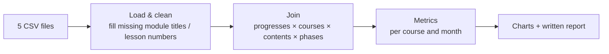

# Education course analytics (pandas)

Analysis of an online-education platform dataset: course structure, student progress and homework activity, to help course producers understand course structure and plan instructor workload.

## Data

Five CSV tables provided as a course assignment (not included in this repository):

| Table | Content |
|---|---|
| `courses` | course id, title, field |
| `course_contents` | modules and lessons per course (homework lessons identified by title) |
| `students` | student id, birthday (used to derive age) |
| `progresses` | student × course enrolment |
| `progress_phases` | per-lesson start and finish dates |

## Pipeline

- **Load and clean:** missing `module_title` and `lesson_number` are filled so the tables join correctly.
- **Join:** progress records are joined with courses, course contents and lesson phases.
- **Metrics:** modules, lessons and students per course and field; student age distribution; number of students starting their first homework per course per month (2016-03 to 2019-07) as a proxy for instructor workload.
- **Output:** matplotlib charts and two written reports with findings and recommendations.

## Repository structure

| Path | What it is |
|---|---|
| `Educational course analytics/ Description and initial work with data/` | data overview: code, charts, report |
| `Educational course analytics/Analysis of Potential Teacher Workload/` | instructor workload analysis: code, chart, report |

## Stack

Python, pandas, NumPy, matplotlib (Google Colab).

## Limitations

- The dataset is not included, so the code cannot be run as is.
- Code was written as Colab notebooks exported to plain files (`my_code`, no `.py` extension) and reads from `/content/...` paths.
- Exploratory analysis, not a production pipeline: no tests, no scheduling, no persistent storage.
